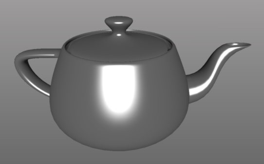
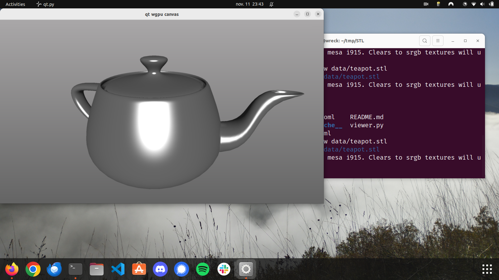

# 3D Geometry File Formats



## Quickstart

Install [pixi], then run

```
pixi read show
```

to have a look at the project aim and

```
pixi run edit
```

to start working on it.

You can also use `pixi run view` to have a look at STL and OBJ files. 
For example:

```
pixi run view data/teapot.stl
```




[pixi]: https://pixi.sh/dev/
